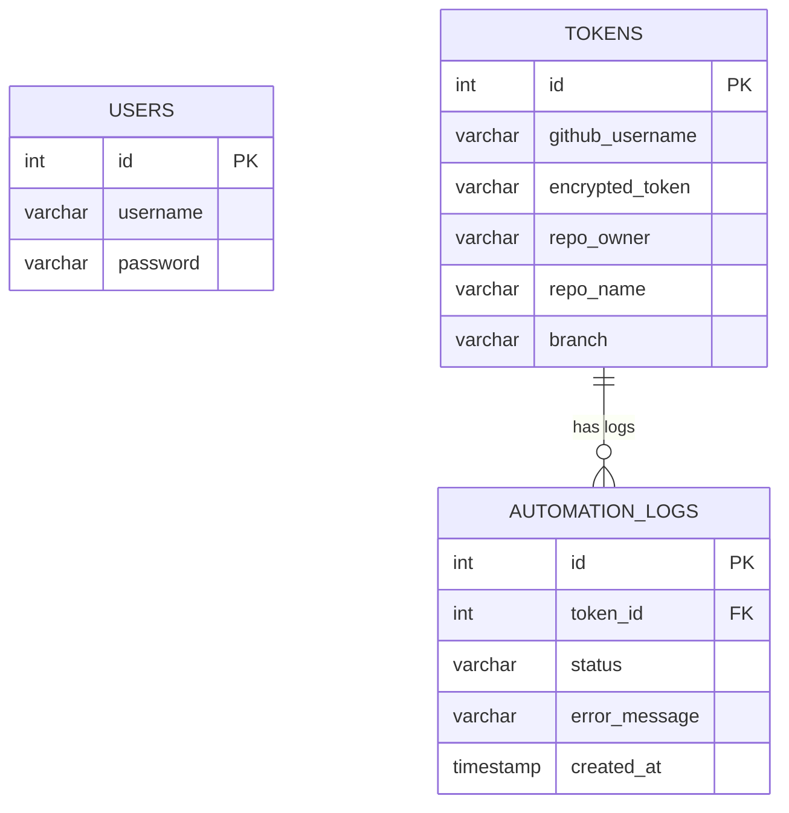

# Ishicodes Automation Dashboard

This project is an automation system designed to push daily coding solutions (C and Python) to users' GitHub repositories. It features a Next.js dashboard where users can view the schedule of questions, view the solutions natively, and manually or automatically push solutions to their configured GitHub repositories.

## GitHub Setup & Credentials Guide

To use the automation effectively, you need to configure your GitHub token and repository details.

**1. Personal Access Token:**
- Go to GitHub -> Settings -> Developer Settings -> Personal Access Tokens (Classic).
- Click "Generate new token (classic)".
- Give it a name, expiration, and check the `repo` scope (for pushing code).
- Copy the generated token and save it securely.

**2. Repository Owner and Name:**
- If your GitHub URL is `https://github.com/manish-9245/homework`, then:
  - **Repo Owner**: `manish-9245`
  - **Repo Name**: `homework`

**3. Branch:**
- This is the branch where the solutions will be pushed (e.g., `main` or `master`).

---

## Database Schema

The system uses a MySQL database to manage users, tokens (GitHub credentials), and automation push logs. Below is the database schema represented as a Mermaid diagram.

### Table Details

- **USERS**: Stores the administrative or dashboard users with their hashed passwords.
- **TOKENS**: Stores GitHub credentials and repository configurations. Each entry specifies where the code should be pushed (`repo_owner`, `repo_name`, `branch`). 
- **AUTOMATION_LOGS**: Keeps track of every push attempt (either manual or scheduled via cron jobs), storing the outcome (`status` = `SUCCESS` or `FAILED`), any associated error messages, and the timestamp.

## How It Works

1. **Solution Storage**: Solutions are stored locally in the `solutions/[DATE]/` directory (e.g., `solutions/2026-05-28/Q1.c`).
2. **Dashboard**: The frontend fetches the daily schedule from `lib/data/schedule.ts` and maps each day's questions to the corresponding files.
3. **Automation**: `lib/automation.ts` handles the git operations. It creates a temporary directory, clones the user's repository, structures the local solutions into a `day[X]/` directory (e.g. `day1_q1.c`), commits, and pushes them directly to the specified GitHub repository branch using the configured token.
4. **Tracking**: The status of these automation runs is recorded in the `AUTOMATION_LOGS` table, which is queried by the dashboard to show the last successful push.
